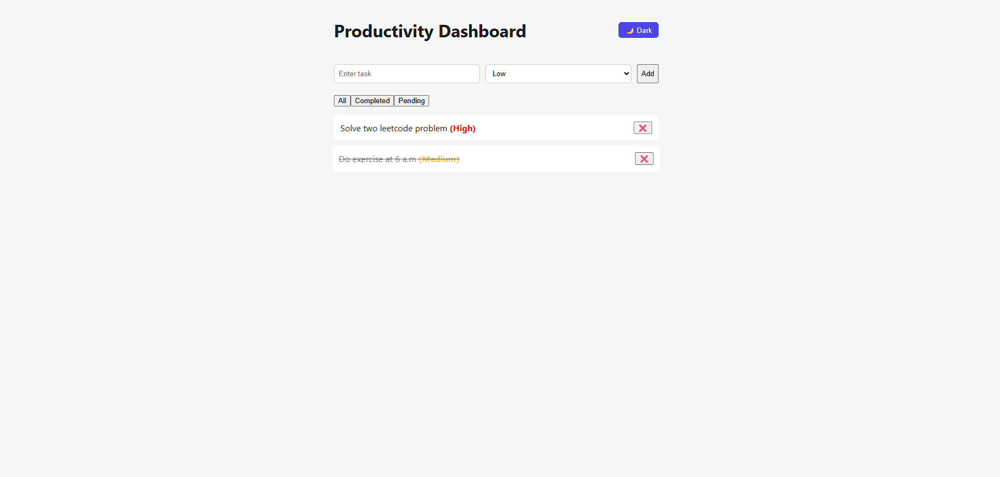
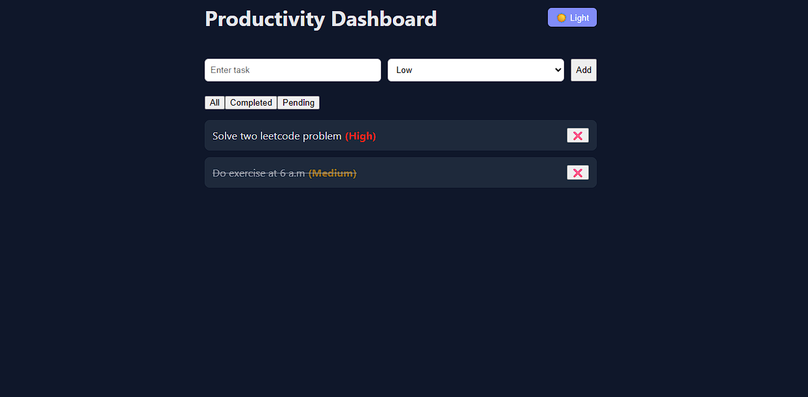

# Productivity Dashboard

A simple and clean productivity dashboard built using React to manage daily tasks efficiently.

---

## 🚀 Features

- Add, delete, and mark tasks as completed
- Task priority support (Low, Medium, High)
- Filter tasks by status (All, Completed, Pending)
- Persistent data storage using localStorage
- Light and Dark mode with saved user preference
- Responsive and clean UI
- Subtle animations for better user experience

---

## 🛠 Tech Stack

- React
- JavaScript
- HTML
- CSS

---

## 📦 Concepts Used

- React Hooks (`useState`, `useEffect`)
- Component-based architecture
- Props and state management
- Conditional rendering
- LocalStorage for data persistence
- CSS variables and animations

---

## 📁 Folder Structure

src/
├── components/
│ ├── TaskForm.jsx
│ ├── TaskList.jsx
│ ├── TaskItem.jsx
│ └── Filter.jsx
├── App.jsx
├── App.css
├── main.jsx

---

## 📸 Screenshots

- - 
- 

## How to Run Locally
- npm install
- npm run dev